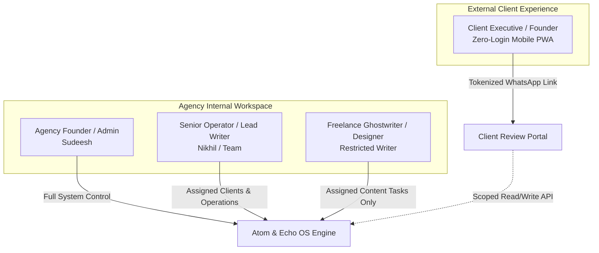

# User Roles & Permission Matrix: Atom & Echo OS

This document outlines the user roles, operational personas, permission boundaries, and interaction paradigms within the Atom & Echo Operating System.

---

## 1. System Personas Overview

---

## 2. Detailed Persona Profiles

### 1. Agency Founder / Executive Admin
* **Primary Real-World User**: Sudeesh
* **Core Responsibilities**:
  * High-level client relationship management and commercial negotiations.
  * Quality control and internal sign-off on strategic messaging.
  * Financial oversight: tool expenses, billing generation, and retainer collection.
  * Operational triage: reviewing stalled work, unblocking team members, handling emergency client holds.
* **Key Screen Surfaces**:
  * **Unified Command Center**: High-priority triage feed, overdue alerts, financial health summary.
  * **Client Hub & Engagement Profiles**: Contract terms, renewal dates, and commercial margins.
  * **Master Temporal Calendar**: Global operational view of content, campaigns, and renewals.
  * **System Administration**: Team seats, security vault master audit logs, billing preferences.
* **Authentication**: Multi-Factor Authenticated (MFA) session via Supabase Auth.

---

### 2. Senior Operator / Lead Ghostwriter
* **Primary Real-World User**: Nikhil / Senior Agency Lead
* **Core Responsibilities**:
  * Daily execution of personal branding content calendars.
  * Interviewing clients and capturing founder context/transcripts.
  * Managing drafts from initial idea through internal review and client delivery.
  * Monitoring campaign performance and updating external Sheet links.
* **Key Screen Surfaces**:
  * **Content Production Studio**: Rich post editor, tone token drawer, client story references.
  * **Client Workspace**: Scoped view of assigned clients, content pipeline, and requests.
  * **Assigned Tasks**: Prioritized list of personal action items.
* **Authentication**: Standard Email + Password / Magic Link session via Supabase Auth.

---

### 3. Junior Ghostwriter / Design Contractor
* **Primary Real-World User**: Specialized contract writers, carousel visual designers, video editors.
* **Core Responsibilities**:
  * Drafting assigned posts within defined positioning boundaries.
  * Designing carousels and creating media attachments.
* **Permission Constraints**:
  * Cannot view client commercial terms or retainer pricing.
  * Cannot view or unmask client passwords in the Credential Vault.
  * Cannot view other clients they are not explicitly assigned to.
  * Cannot transition content directly to `Client Review` (must route to `Internal Review` first).

---

### 4. Client Executive / Founder Reviewer
* **Primary Real-World User**: Client Founders, CEOs, and Executive Partners.
* **Behavioral Traits**:
  * Extreme time scarcity, mobile-first usage pattern, low patience for administrative software.
  * Refuses to download new desktop software, remember passwords, or navigate multi-level navigation trees.
* **Core Responsibilities**:
  * 1-tap review and approval of weekly/monthly LinkedIn post batches.
  * Adding quick feedback notes or requesting tone adjustments.
  * Submitting ad-hoc requests (e.g., event coverage, emergency hold on publishing).
* **Key Screen Surfaces**:
  * **Client Review Mobile PWA**:
    * Zero-login, mobile-optimized feed simulating actual LinkedIn mobile rendering.
    * 1-tap "Approve Post" button.
    * Contextual revision box with pre-set quick tags (*"Needs stronger hook"*, *"Too casual"*, *"Update metric"*).
    * Archive view of previously approved and published posts.
* **Authentication**: Cryptographically signed, expiring tokenized magic link (`HMAC-SHA256`) delivered directly via WhatsApp or Email.

---

## 3. Comprehensive Permissions Matrix

| Functional Capability | Agency Admin (Sudeesh) | Lead Operator (Nikhil) | Junior Contractor | Client Reviewer |
| :--- | :---: | :---: | :---: | :---: |
| **Command Center Access** | Full System | Assigned Clients | No Access | No Access |
| **View All Clients** | Yes | Yes | Assigned Only | Own Profile Only |
| **Create / Edit Client Record** | Yes | Yes | No | No |
| **View Client Retainer & Pricing** | Yes | Read Only | Hidden | Hidden |
| **Manage Invoices & Tool Billing** | Yes | No | No | View Own Invoices |
| **Create / Draft Content** | Yes | Yes | Yes (Assigned) | No |
| **Internal Review Approval** | Yes | Yes | No | No |
| **Trigger Client Review Link** | Yes | Yes | No | No |
| **Approve Content (Client Sign-Off)** | Yes (Override) | No | No | **Yes (Primary)** |
| **View Credential Vault Secrets** | Unmask & Copy | Masked (Copy with Audit) | Hidden | Hidden |
| **Add / Delete Credentials** | Yes | Yes | No | Can Submit via Form |
| **Submit Client Request / Ticket** | Yes | Yes | Yes | Yes |
| **Change Request Status (Close/Resolve)** | Yes | Yes | Assigned Only | Can Reopen |
| **Access Master Calendar** | Full Global | Assigned Clients | Assigned Content | Scheduled Content |
| **System Settings & User Management** | Yes | No | No | No |

---

## 4. Security & Access Boundaries

1. **Row-Level Security (RLS)**:
   * PostgreSQL database enforces data isolation at the query level using `auth.uid()` and user tenant claims.
   * Internal operators can only query data matching their organizational ID or assigned client IDs.
   * Client PWA endpoints query a specialized PostgreSQL security barrier function that verifies token signature and expiration before returning content rows.

2. **Audit Logging on Sensitive Actions**:
   * Any action that unmasks a password in the Credential Vault creates an immutable record in `audit_logs` storing: `user_id`, `client_id`, `credential_id`, `action = 'UNMASK_PASSWORD'`, `ip_address`, and `timestamp`.
   * Any client approval or rejection logs the client token metadata, IP, user-agent, and exact timestamp.
