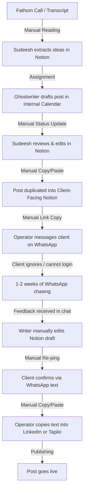
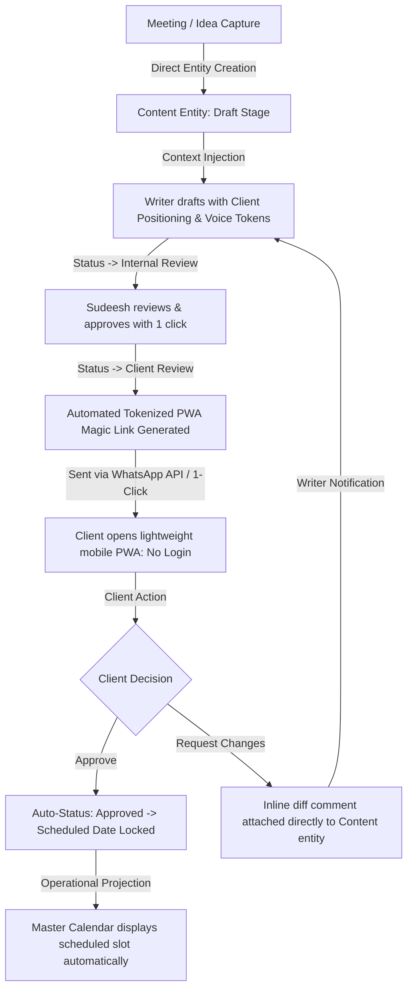
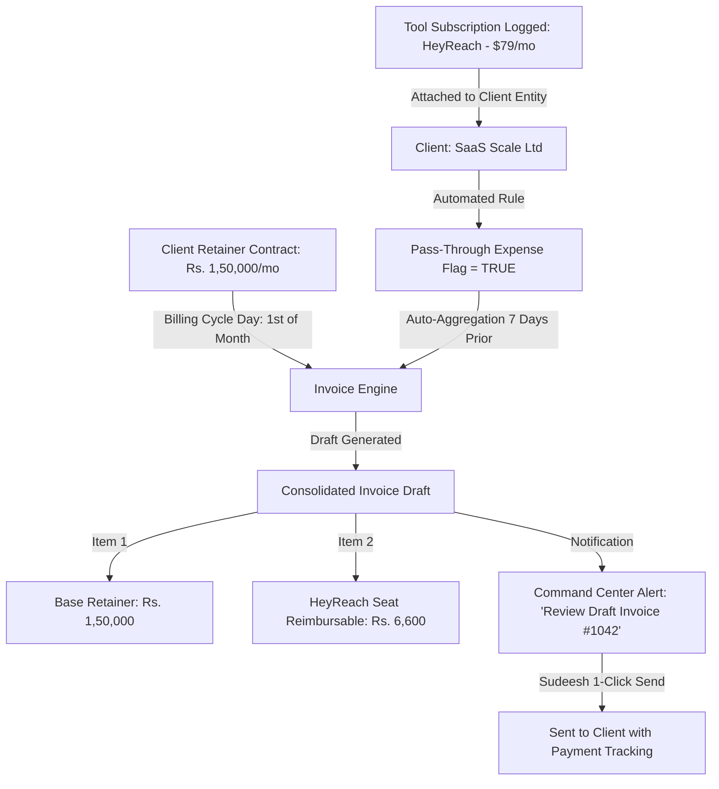

# Workflow Map: Current Process vs. Target Operating System

This document maps the end-to-end operational workflows of Atom & Echo, contrasting the current fragmented multi-tool reality with the unified target flow implemented in the Atom & Echo Operating System (BaseEngine).

---

## 1. Executive Summary of Workflow Transformation

| Operational Loop | Current Process (Notion + Sheets + WhatsApp) | Target OS Process (Unified BaseEngine) | Velocity / Friction Impact |
| :--- | :--- | :--- | :--- |
| **Content Production** | Internal Calendar -> Copy/paste into Client Calendar -> WhatsApp ping | Single Content entity with internal/client visibility states | Eliminates 100% duplicate card entry and sync errors |
| **Client Review** | Desktop Notion page link sent over WhatsApp; client requires login | Zero-login mobile PWA link via tokenized WhatsApp message | Review turnaround drops from 3–7 days to < 10 minutes |
| **Client Intelligence** | Fathom recordings in browser + disparate Notion text blocks | Centralized Knowledge Vault (Positioning, Tone, Proof, Stories) | Ghostwriters write in authentic voice without re-asking questions |
| **Credential Management** | Plaintext in Notion pages or scattered across WhatsApp chats | AES-256 encrypted Credential Vault with role masking & audit log | Zero security leaks; instant access for authorized operators |
| **Tool & Retainer Billing** | Manual memory of renewal dates; separate Sheet for tool pass-through | Auto-generated invoice drafts 7 days prior to renewal | Prevents unbilled tool expense leakage (Rs. 15k–40k/mo saved) |
| **Ad-Hoc Client Requests** | Casual WhatsApp voice notes/messages; easily lost or forgotten | Structured Request entity with SLA tracking & assignment | Zero dropped requests; transparent client status visibility |

---

## 2. Content Production & Distribution Loop

### Current Workflow (Fragmented)

**Friction Points & Failure Modes:**
- **Duplicate Data Entry**: Every approved post must be copied from the internal board into the client board. Edits made in one don't propagate to the other.
- **Client Login Wall**: Clients are founders using mobile devices. Notion mobile app requires authentication, leading to prompt abandonment.
- **WhatsApp Context Drift**: Revisions happen in unstructured chat threads, requiring writers to hunt through chat history to find client wording preferences.

---

### Target OS Workflow (Unified)

**Key Operational Upgrades:**
- **Single Source of Truth**: One single `Content` row with state progression (`Draft` -> `Internal Review` -> `Client Review` -> `Approved` -> `Scheduled` -> `Published`).
- **Zero-Login PWA**: Clients click a cryptographically signed magic link from WhatsApp, view a pristine mobile card, tap "Approve" or add inline comments.
- **Zero Manual Sync**: The calendar is an automatic temporal projection of the content entity's `scheduled_date`.

---

## 3. Client Review & Approval Loop

### Current Reality: The "WhatsApp Chasing" Cycle
1. Nikhil or Sudeesh finishes a batch of 5 LinkedIn posts in Notion.
2. Operator copies the link to the client's public Notion page.
3. Operator pastes the link into WhatsApp: *"Hey, uploaded 5 new posts for next week, please review!"*
4. Client opens link on mobile -> Notion asks for Google login or displays desktop layout poorly.
5. Client closes browser and plans to "check it on laptop later".
6. 4 days pass. No review. Publishing schedule slips.
7. Operator sends follow-up: *"Hey bro, gentle reminder on the posts."*
8. Client replies on WhatsApp with voice note: *"On post 2, change the hook to talk about ARR instead of MRR."*
9. Operator listens to voice note, opens Notion, finds Post 2, manually interprets and rewrites the hook.
10. Feedback history is permanently buried in WhatsApp chats.

### Target OS Reality: Frictionless Micro-App
1. Operator marks batch as `Client Review`.
2. System produces a short, secure URL: `os.atomecho.com/review/tok_9f82b1...`
3. Client opens the link in iOS Safari or Android Chrome in under 1.5 seconds without any account creation or login.
4. Mobile UI displays posts as realistic LinkedIn preview cards with image/carousel mockups.
5. Client taps green **"Approve Post"** button or highlights a sentence and taps **"Revise"** with quick suggestions.
6. The moment the client taps Approve:
   - Content status shifts instantly to `Approved`.
   - Webhook notifies the assigned operator on Slack/Discord/WhatsApp.
   - Master Calendar immediately books the publishing slot.

---

## 4. Client Onboarding & Intelligence Loop

### Current Workflow
- Onboarding call conducted on Google Meet with Fathom recording.
- Fathom generates summary in external browser tab.
- Operator creates a new Notion page for client under *Clients - LinkedIn Personal Branding*.
- Notes, website links, target audience, and sample posts are pasted into raw text blocks.
- Over time, client notes become cluttered and unsearchable.
- When a new ghostwriter is assigned, they must read through 15 unstructured pages or bother Sudeesh for tone guidance.

### Target OS Workflow: Structured Client Intelligence
```
Client Profile (e.g., John Doe - Founder at FinTech Corp)
├── Core Identity: Industry, ICP, Positioning Statement, Value Proposition
├── Voice Matrix:
│   ├── Tone Tags: Direct, Contrarian, Technical, Data-Driven
│   ├── Forbidden Words: "leverage", "delve", "synergy", "game-changer"
│   └── Writing Archetype: The Builder-Operator
├── Knowledge Bank:
│   ├── Origin Story (Seed round, engineering pivot, zero-to-one journey)
│   ├── Proprietary Frameworks (e.g., "The 3-Tier Liquidity Rule")
│   └── Verified Proof Points (Metric: $10M ARR, 45k Users, Case Studies)
└── Credential Vault (AES-256):
    ├── LinkedIn Personal Account (Email/Pass/2FA notes)
    ├── Taplio / HeyReach Seat
    └── CMS / Blog Access
```
**Impact**: Writers have immediate, in-context access to the client's verified facts and tone rules right inside the content editor drawer.

---

## 5. Tool Subscription & Financial Billing Loop

### Current Workflow
- Atom & Echo purchases client-specific software licenses (e.g., HeyReach seat at $79/mo, Clay credits at $149, custom proxy, email domain setups).
- Costs are entered in a Notion database called *Tool Purchases*.
- End of month arrives: Sudeesh tries to remember which tools belong to which retainer.
- Invoices are created manually in an external tool or Word doc.
- Frequently, tool pass-through expenses are missed, resulting in the agency absorbing third-party software overhead.

### Target OS Workflow: Automated Expense & Invoice Alignment

**Impact**: 100% expense capture. Sudeesh gets a notification on the 24th of each month showing all billable retainers and accrued pass-through software fees.

---

## 6. Client Requests & Support Lifecycle

### Current Workflow
- Client texts Sudeesh at 10 PM on WhatsApp: *"Hey, need to pause all posts for tomorrow, we have an emergency board meeting."*
- Sudeesh is away from desk; mental note made.
- Next morning, writer schedules post anyway because Notion wasn't updated.
- Emergency post goes live; client is furious.

### Target OS Workflow
- Client or operator files an emergency request via mobile PWA or quick Command Center shortcut:
  - **Category**: `Emergency Hold` / `Content Update` / `Bug` / `Design Request`
  - **Priority**: `Urgent` / `High` / `Normal`
- Creating an `Emergency Hold` request immediately trips the content state machine:
  - All posts for that client in `Scheduled` state transition to `Paused (Hold)`.
  - Push notification alerts the assigned ghostwriter instantly.
  - Sudeesh sees a flashing warning badge on the Command Center triage feed.
