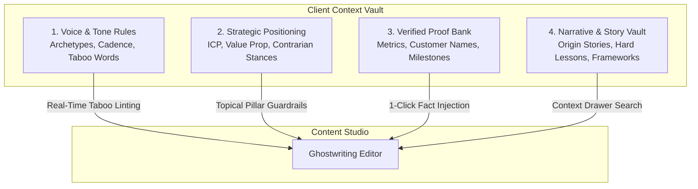
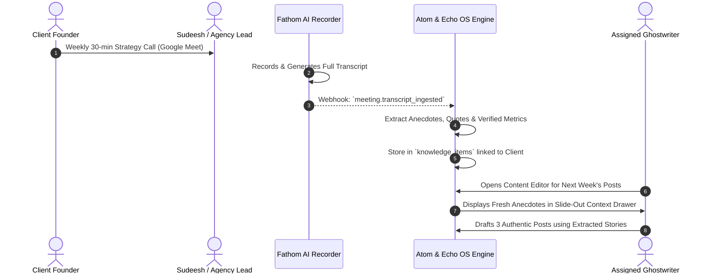

# Context Model: Founder Intelligence & Brand Voice Architecture

This document specifies the Context & Intelligence Layer of the Atom & Echo Operating System. It defines how founder personality, verified business facts, contrarian opinions, and tone rules are structured to empower ghostwriters and AI systems to produce authentic, high-converting content.

---

## 1. The Core Problem: The Generic Agency Fluff Trap

Most agency content pipelines fail because of **Context Amnesia**:
* Ghostwriters don't know the client personally. They rely on brief bullet points or generic AI prompts.
* Result: Content sounds like generic LinkedIn clichés (*"I'm humbled to announce...", "In today's fast-paced world...", "Here are 5 learnings on leadership..."*).
* Clients reject drafts because *"This doesn't sound like me,"* or *"I would never use this phrase."*
* Endless review cycles occur because verified facts, exact numbers, and authentic stories are trapped in Sudeesh's head or buried in 45-minute Fathom recordings.

**The Solution**: The Atom & Echo OS treats **Client Context as a First-Class Operating Primitive**. Every client profile houses a structured intelligence vault that is dynamically injected into the writing environment.

---

## 2. The 4 Context Dimensions

---

## 3. Deep Specification of Context Dimensions

### 3.1 Dimension 1: Voice & Tone Matrix
* **Tone Archetype**:
  * *Contrarian Builder*: Direct, blunt, focuses on raw engineering/product truths, dislikes marketing speak.
  * *Analytical Operator*: Data-heavy, systems thinker, uses frameworks, structured breakdowns, metrics.
  * *Vulnerable Founder*: Open about failure, pivots, investor rejections, mental stamina.
* **Cadence & Sentence Mechanics**:
  * Short, punchy opening lines (Hooks < 12 words).
  * No run-on sentences. 1–2 sentences per paragraph maximum.
  * Minimal use of emojis; no rocket ships or fire emojis.
* **Taboo Words Engine**:
  * Words that immediately trigger a linting warning in the editor:
    * `{"synergy", "game-changer", "delve", "paradigm shift", "leverage", "unleash", "humbled", "thrilled", "excited to announce", "testament"}`

### 3.2 Dimension 2: Strategic Positioning & ICP
* **Core Value Proposition**: The single sharpest reason someone buys from or follows this client.
* **Target Audience (ICP)**: E.g., *"Series A/B CTOs building high-throughput microservices."*
* **Contrarian Stances (Beliefs against the herd)**:
  * Example: *"Microservices are a mistake for companies with under 50 engineers; monoliths win."*
  * Example: *"Cold calling isn't dead; your offer is just boring."*

### 3.3 Dimension 3: Verified Proof Bank
* **Definition**: A curated, authenticated database of business facts that writers can reference with 100% confidence.
* **Schema**:
  | Fact Key | Verified Value | Category | Verification Source |
  | :--- | :--- | :--- | :--- |
  | `arr_current` | "$12.4M ARR" | Financial | Q3 2026 Board Deck |
  | `customer_count` | "140 Enterprise Clients" | Market Traction | Client Onboarding Call |
  | `headcount` | "85 Full-Time Engineers" | Team | Founder Interview |
  | `top_customer` | "Fortune 500 Logistics Provider" | Case Study | Sudeesh Review |

### 3.4 Dimension 4: Narrative & Story Vault
* **Origin Stories**: How the business was founded, the initial desperation, the early near-death experiences.
* **Pivotal Moments**: The customer who almost sued, the migration that crashed at 2 AM, the pricing experiment that tripled revenue.
* **Proprietary Frameworks**: Methodologies unique to this founder (e.g., *"The 3-Day Rule for Enterprise Sales"*).

---

## 4. Operational Ingestion Pipeline

1. **Passive Capture**: Every meeting recorded on Fathom sends its raw transcript into the OS.
2. **Context Distillation**: In Phase 1, Sudeesh or an operator tags relevant quotes and metrics into the Knowledge Vault. In Phase 2B, an LLM extraction pipeline automatically categorizes quotes into Stories, Metrics, or Stances.
3. **In-Editor Context Drawer**: While writing in the Content Studio, the writer presses `Cmd + K` or opens the right-hand drawer to search the client's stories, instantly pasting authenticated founder memories into the draft.
