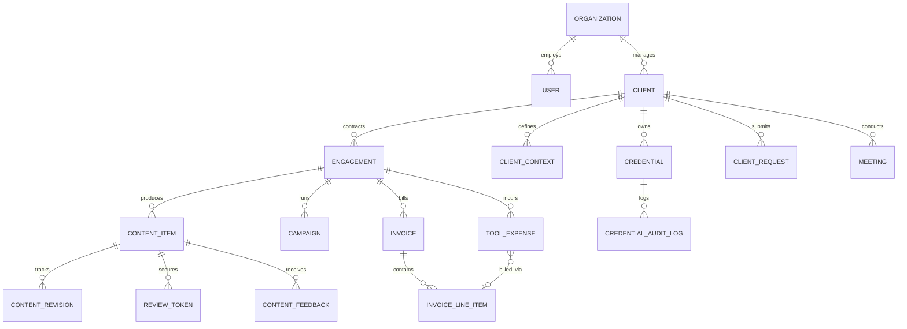

# Domain Model & Entity Specification: Atom & Echo OS

This document details the core domain entities, data attributes, referential integrity rules, and relationships for the Atom & Echo Operating System.

---

## 1. Entity-Relationship Architecture

---

## 2. Core Entities Specification

### 2.1 Tenancy & Identity

#### `organizations`
Represents the agency tenant (Atom & Echo).
* `id`: UUID (PK, default `gen_random_uuid()`)
* `name`: Text (NOT NULL, e.g. 'Atom & Echo')
* `slug`: Text (UNIQUE, NOT NULL, e.g. 'atom-echo')
* `currency`: Text (NOT NULL, default 'INR')
* `created_at`: Timestamptz (default `now()`)

#### `users`
Internal agency staff, founders, and contract team members.
* `id`: UUID (PK, references `auth.users`)
* `organization_id`: UUID (FK -> `organizations.id`, NOT NULL)
* `email`: Text (UNIQUE, NOT NULL)
* `full_name`: Text (NOT NULL)
* `role`: Enum `user_role` (`admin`, `lead_operator`, `writer`, `designer`)
* `avatar_url`: Text (Nullable)
* `is_active`: Boolean (default true)
* `created_at`: Timestamptz (default `now()`)

---

### 2.2 Client & Commercial Architecture

#### `clients`
The client company or founder entity.
* `id`: UUID (PK)
* `organization_id`: UUID (FK -> `organizations.id`, NOT NULL)
* `name`: Text (NOT NULL, e.g. 'FinTech Corp')
* `founder_name`: Text (NOT NULL, e.g. 'John Doe')
* `founder_title`: Text (e.g. 'Founder & CEO')
* `founder_email`: Text (Nullable)
* `founder_phone`: Text (Nullable, for WhatsApp integration)
* `linkedin_url`: Text (Nullable)
* `website_url`: Text (Nullable)
* `status`: Enum `client_status` (`onboarding`, `active`, `paused`, `churned`)
* `created_at`: Timestamptz (default `now()`)

#### `engagements`
Specific contracted service retainers between Atom & Echo and a Client.
* `id`: UUID (PK)
* `client_id`: UUID (FK -> `clients.id`, NOT NULL)
* `service_type`: Enum `service_type` (`linkedin_branding`, `cold_outreach`, `hybrid_growth`)
* `status`: Enum `engagement_status` (`active`, `paused`, `completed`)
* `monthly_retainer`: Numeric(12,2) (NOT NULL, e.g. 150000.00)
* `billing_frequency`: Enum `billing_frequency` (`monthly`, `quarterly`, `project`)
* `billing_anchor_day`: Integer (1-31, day of month invoice drafts are generated)
* `start_date`: Date (NOT NULL)
* `renewal_date`: Date (Nullable)
* `primary_operator_id`: UUID (FK -> `users.id`, assigned lead)
* `created_at`: Timestamptz (default `now()`)

---

### 2.3 Context & Client Intelligence

#### `client_contexts`
Structured founder intelligence that guides content creation.
* `id`: UUID (PK)
* `client_id`: UUID (FK -> `clients.id`, UNIQUE, NOT NULL)
* `positioning_statement`: Text (Core value proposition in the market)
* `target_audience_icp`: Text (Ideal Customer Profile definition)
* `tone_archetype`: Text (e.g. 'Contrarian Builder', 'Technical Operator')
* `voice_guidelines`: Text (Sentence length, cadence, formatting preferences)
* `taboo_words`: Text[] (List of forbidden buzzwords e.g. `{"synergy", "game-changer", "delve"}`)
* `core_pillars`: Text[] (3-5 topical themes the client speaks about)
* `updated_at`: Timestamptz (default `now()`)

#### `knowledge_items`
Discrete anecdotes, origin stories, case studies, and verified proof points.
* `id`: UUID (PK)
* `client_id`: UUID (FK -> `clients.id`, NOT NULL)
* `category`: Enum `knowledge_category` (`origin_story`, `case_study`, `metric_proof`, `framework`, `contrarian_opinion`)
* `title`: Text (NOT NULL, e.g. '$0 to $1M ARR in 9 Months')
* `content`: Text (NOT NULL, full narrative and verified details)
* `verified_metrics`: JSONB (Key-value pairs e.g. `{"arr": "$1M", "customers": 42}`)
* `source_meeting_id`: UUID (FK -> `meetings.id`, Nullable)
* `created_at`: Timestamptz (default `now()`)

---

### 2.4 Content Operations & Review Pipeline

#### `content_items`
Individual content pieces (LinkedIn posts, carousels, articles).
* `id`: UUID (PK)
* `engagement_id`: UUID (FK -> `engagements.id`, NOT NULL)
* `title`: Text (Internal working headline)
* `body_markdown`: Text (The post content)
* `content_format`: Enum `content_format` (`text_only`, `carousel_pdf`, `image_single`, `video`)
* `status`: Enum `content_status` (
    `draft`,
    `internal_review`,
    `client_review`,
    `approved`,
    `scheduled`,
    `published`,
    `rejected`
  )
* `assigned_writer_id`: UUID (FK -> `users.id`, Nullable)
* `assigned_designer_id`: UUID (FK -> `users.id`, Nullable)
* `target_pillar`: Text (Matching a pillar in `client_contexts`)
* `scheduled_publish_date`: Timestamptz (Nullable, projected onto calendar)
* `published_at`: Timestamptz (Nullable)
* `linkedin_post_url`: Text (Nullable, live post URL)
* `created_at`: Timestamptz (default `now()`)
* `updated_at`: Timestamptz (default `now()`)

#### `review_tokens`
Cryptographically signed access tokens for the zero-login client PWA review portal.
* `id`: UUID (PK)
* `client_id`: UUID (FK -> `clients.id`, NOT NULL)
* `token_hash`: Text (UNIQUE, NOT NULL, SHA-256 hash of random token)
* `expires_at`: Timestamptz (NOT NULL)
* `last_accessed_at`: Timestamptz (Nullable)
* `revoked`: Boolean (default false)
* `created_at`: Timestamptz (default `now()`)

#### `content_feedback`
Inline comments and feedback submitted by clients via mobile PWA or internal reviews.
* `id`: UUID (PK)
* `content_item_id`: UUID (FK -> `content_items.id`, NOT NULL)
* `author_type`: Enum `author_type` (`client`, `internal_admin`, `internal_writer`)
* `author_name`: Text (NOT NULL)
* `highlighted_text`: Text (Nullable, text snippet being commented on)
* `comment`: Text (NOT NULL)
* `is_resolved`: Boolean (default false)
* `created_at`: Timestamptz (default `now()`)

---

### 2.5 Security & Credential Vault

#### `credentials`
Encrypted login details, API keys, and session cookies for client accounts.
* `id`: UUID (PK)
* `client_id`: UUID (FK -> `clients.id`, NOT NULL)
* `platform`: Text (NOT NULL, e.g. 'LinkedIn Personal', 'HeyReach', 'Clay', 'Webflow')
* `username_or_email`: Text (NOT NULL)
* `encrypted_password`: Text (NOT NULL, encrypted via AES-256-GCM using master vault key)
* `two_factor_method`: Text (Nullable, e.g. 'SMS to Sudeesh Phone', 'Authy', 'Backup codes')
* `notes`: Text (Nullable, sensitive session guidance)
* `last_updated_by`: UUID (FK -> `users.id`, NOT NULL)
* `updated_at`: Timestamptz (default `now()`)

#### `credential_audit_logs`
Immutable compliance and security record of every credential access.
* `id`: UUID (PK)
* `credential_id`: UUID (FK -> `credentials.id`, NOT NULL)
* `user_id`: UUID (FK -> `users.id`, NOT NULL)
* `action`: Enum `vault_action` (`view_masked`, `unmask_password`, `copy_password`, `update_secret`)
* `ip_address`: Text (NOT NULL)
* `user_agent`: Text (NOT NULL)
* `created_at`: Timestamptz (default `now()`)

---

### 2.6 Financials & Tool Billing

#### `tool_subscriptions`
Third-party SaaS tools procured by the agency.
* `id`: UUID (PK)
* `organization_id`: UUID (FK -> `organizations.id`, NOT NULL)
* `tool_name`: Text (NOT NULL, e.g. 'HeyReach Seat', 'Clay Pro', 'Smartlead Mailboxes')
* `billing_cycle`: Enum `tool_cycle` (`monthly`, `annual`, `credits`)
* `cost_amount`: Numeric(10,2) (NOT NULL)
* `currency`: Text (default 'USD')
* `next_renewal_date`: Date (NOT NULL)
* `default_pass_through`: Boolean (default true)

#### `tool_expenses`
Specific tool costs allocated to a client engagement for reimbursement.
* `id`: UUID (PK)
* `engagement_id`: UUID (FK -> `engagements.id`, NOT NULL)
* `tool_subscription_id`: UUID (FK -> `tool_subscriptions.id`, Nullable)
* `description`: Text (NOT NULL, e.g. 'Clay 5k Enrichment Credits - March')
* `amount`: Numeric(10,2) (NOT NULL)
* `currency`: Text (default 'INR')
* `incurred_date`: Date (NOT NULL)
* `status`: Enum `expense_status` (`unbilled`, `drafted_in_invoice`, `invoiced`, `reimbursed`)
* `created_at`: Timestamptz (default `now()`)

#### `invoices`
Monthly retainer and pass-through software invoices.
* `id`: UUID (PK)
* `engagement_id`: UUID (FK -> `engagements.id`, NOT NULL)
* `invoice_number`: Text (UNIQUE, NOT NULL, e.g. 'AE-2026-0042')
* `issue_date`: Date (NOT NULL)
* `due_date`: Date (NOT NULL)
* `subtotal_amount`: Numeric(12,2) (NOT NULL)
* `tax_amount`: Numeric(12,2) (default 0.00)
* `total_amount`: Numeric(12,2) (NOT NULL)
* `currency`: Text (default 'INR')
* `status`: Enum `invoice_status` (`draft`, `approved`, `sent`, `paid`, `overdue`, `cancelled`)
* `paid_at`: Timestamptz (Nullable)
* `created_at`: Timestamptz (default `now()`)

#### `invoice_line_items`
Individual line items on an invoice (Retainer + itemized tools).
* `id`: UUID (PK)
* `invoice_id`: UUID (FK -> `invoices.id`, NOT NULL)
* `tool_expense_id`: UUID (FK -> `tool_expenses.id`, Nullable)
* `description`: Text (NOT NULL)
* `quantity`: Integer (default 1)
* `unit_price`: Numeric(12,2) (NOT NULL)
* `total_price`: Numeric(12,2) (NOT NULL)

---

### 2.7 Operations & Client Service Requests

#### `client_requests`
Structured operational tickets submitted by clients or operators.
* `id`: UUID (PK)
* `client_id`: UUID (FK -> `clients.id`, NOT NULL)
* `title`: Text (NOT NULL)
* `description`: Text (NOT NULL)
* `category`: Enum `request_category` (`emergency_hold`, `content_pivot`, `design_tweak`, `tool_issue`, `general_query`)
* `priority`: Enum `request_priority` (`urgent`, `high`, `normal`, `low`)
* `status`: Enum `request_status` (`submitted`, `acknowledged`, `in_progress`, `resolved`, `closed`)
* `assigned_to`: UUID (FK -> `users.id`, Nullable)
* `resolved_at`: Timestamptz (Nullable)
* `created_at`: Timestamptz (default `now()`)
