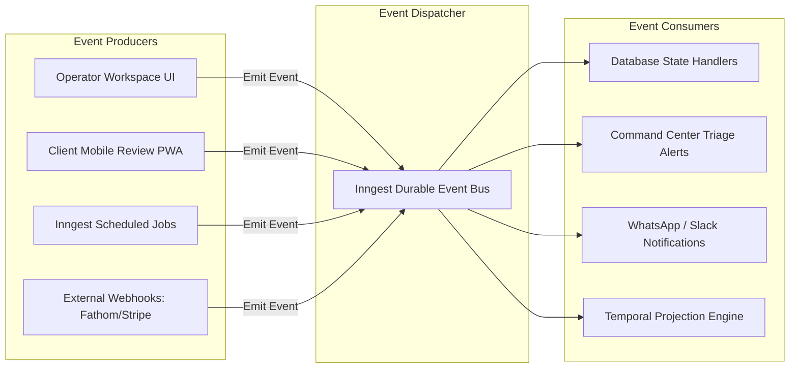

# Event Model & Asynchronous Side-Effects: Atom & Echo OS

This document catalogs all operational events emitted across the Atom & Echo Operating System, their JSON schemas, producers, consumers, and background side-effects managed by Inngest.

---

## 1. Event-Driven Architecture Overview



---

## 2. Event Catalog & Payload Specifications

### 2.1 Content Operations Events

#### `content.client_review_requested`
Emitted when an operator transitions a post or batch to client review.
* **Producer**: Internal Content Editor / Batch Review Screen
* **Payload**:
  ```json
  {
    "event": "content.client_review_requested",
    "data": {
      "client_id": "8a7c6b5a-1234-4567-89ab-cdef01234567",
      "engagement_id": "9b8d7c6e-2345-5678-90bc-def012345678",
      "content_item_ids": ["c1a2b3c4-...", "c5d6e7f8-..."],
      "requested_by_user_id": "u1b2c3d4-...",
      "timestamp": "2026-09-18T10:00:00Z"
    }
  }
  ```
* **Downstream Side-Effects**:
  1. Generates a secure `review_token` with 7-day expiration.
  2. Constructs the signed review link: `https://os.atomecho.com/review?token=...`
  3. Formats WhatsApp template message with the magic link for Sudeesh to send in 1 click or auto-sends via WhatsApp Business API.
  4. Starts an Inngest durable delay timer (48 hours) to check for pending approvals.

#### `content.client_approved`
Emitted when a client taps "Approve Post" inside the mobile PWA.
* **Producer**: Client Review Mobile PWA
* **Payload**:
  ```json
  {
    "event": "content.client_approved",
    "data": {
      "content_item_id": "c1a2b3c4-...",
      "client_id": "8a7c6b5a-...",
      "token_id": "tok_9f82b1...",
      "ip_address": "49.37.12.84",
      "user_agent": "Mozilla/5.0 (iPhone; CPU iPhone OS 17_4 like Mac OS X)...",
      "timestamp": "2026-09-18T10:14:22Z"
    }
  }
  ```
* **Downstream Side-Effects**:
  1. Transitions `content_items.status` from `client_review` to `approved`.
  2. Calculates and assigns the next open publishing date from the engagement publishing cadence.
  3. Updates `content_items.status` to `scheduled`.
  4. Projects card onto the Master Temporal Calendar.
  5. Sends immediate Slack/WhatsApp notification to assigned ghostwriter: *"Post approved by client!"*

#### `content.client_revision_requested`
Emitted when a client leaves inline comments and submits revision feedback.
* **Producer**: Client Review Mobile PWA
* **Payload**:
  ```json
  {
    "event": "content.client_revision_requested",
    "data": {
      "content_item_id": "c1a2b3c4-...",
      "client_id": "8a7c6b5a-...",
      "feedback_items": [
        {
          "highlighted_text": "We scaled our MRR rapidly",
          "comment": "Change to ARR, not MRR. We only track ARR."
        }
      ],
      "timestamp": "2026-09-18T10:18:05Z"
    }
  }
  ```
* **Downstream Side-Effects**:
  1. Transitions `content_items.status` from `client_review` to `draft`.
  2. Creates records in `content_feedback` table linked to the post.
  3. Triggers urgent action badge for the assigned writer with the feedback snippet.

---

### 2.2 Client Requests & Operations Events

#### `client.emergency_hold_triggered`
Emitted when a client or Sudeesh triggers an urgent hold on all publishing.
* **Producer**: Client PWA / Command Center Quick Action
* **Payload**:
  ```json
  {
    "event": "client.emergency_hold_triggered",
    "data": {
      "client_id": "8a7c6b5a-...",
      "reason": "Emergency Board Meeting - All communications frozen until Friday",
      "triggered_by": "client",
      "timestamp": "2026-09-18T14:30:00Z"
    }
  }
  ```
* **Downstream Side-Effects**:
  1. Creates an urgent `client_requests` ticket with category `emergency_hold`.
  2. Executes an atomic SQL update setting `content_items.status = 'paused'` for all posts belonging to that client in status `scheduled`.
  3. Sends emergency alert to Sudeesh and the assigned lead operator.

---

### 2.3 Financial & Invoicing Events

#### `billing.cycle_approaching`
Emitted 7 days prior to a client engagement's `billing_anchor_day`.
* **Producer**: Inngest Daily Cron (`0 0 * * *`)
* **Payload**:
  ```json
  {
    "event": "billing.cycle_approaching",
    "data": {
      "engagement_id": "9b8d7c6e-...",
      "client_id": "8a7c6b5a-...",
      "anchor_day": 1,
      "billing_month": "2026-10",
      "timestamp": "2026-09-24T00:00:00Z"
    }
  }
  ```
* **Downstream Side-Effects**:
  1. Queries all `tool_expenses` for this engagement where `status = 'unbilled'`.
  2. Automatically compiles a draft `invoices` record containing the base monthly retainer plus all unbilled tool expenses as line items.
  3. Updates tool expense status to `drafted_in_invoice`.
  4. Adds a task to the Command Center: *"Review draft invoice for [Client Name] (Total: Rs. X)"*.

---

### 2.4 Security & Compliance Events

#### `credential.unmasked`
Emitted every time an internal operator clicks "Reveal" or "Copy" on a password.
* **Producer**: Credential Vault UI Component
* **Payload**:
  ```json
  {
    "event": "credential.unmasked",
    "data": {
      "credential_id": "cred_42a1...",
      "client_id": "8a7c6b5a-...",
      "user_id": "u1b2c3d4-...",
      "action": "unmask_password",
      "ip_address": "103.21.124.5",
      "timestamp": "2026-09-18T11:45:10Z"
    }
  }
  ```
* **Downstream Side-Effects**:
  1. Inserts an immutable row into `credential_audit_logs`.
  2. If accessed after work hours (> 10 PM) or from an unrecognized IP, sends an audit warning email to Sudeesh.
