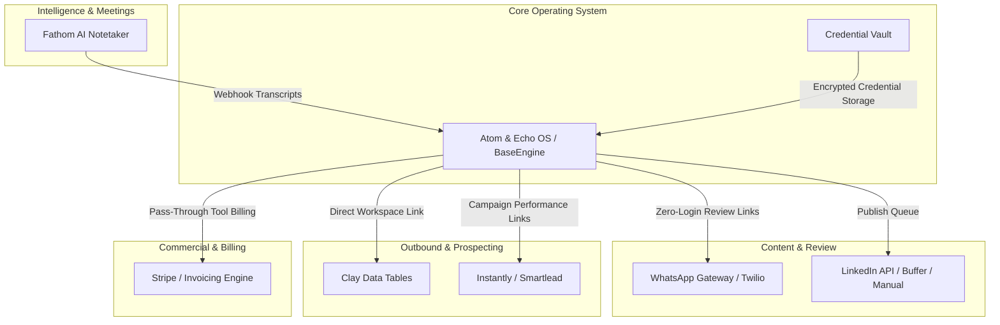

# Integration Map & External Tool Boundaries: Atom & Echo OS

To prevent feature creep and platform instability, Atom & Echo OS operates as a high-leverage orchestrator that integrates with proven third-party tools rather than rebuilding them.

---

## 1. External System Topology

---

## 2. Integration Protocols & Boundaries

### 2.1 Fathom AI Meeting Intelligence
* **Role**: Meeting capture and transcript ingestion.
* **Flow**: Fathom webhook → Inngest durable endpoint → Extract key decisions & client requests → Operator confirmation drawer in Command Center.
* **Boundary**: The OS does NOT replace Fathom's video recording or transcription engine; it only consumes the structured output.

### 2.2 WhatsApp Gateway (Tokenized Review Links)
* **Role**: Zero-friction client review delivery.
* **Flow**: Content moves to `client_review` → OS generates signed HMAC token → WhatsApp link sent to founder → 1-click PWA review screen.
* **Boundary**: Message delivery is handled by WhatsApp API / Twilio; review actions take place on the lightweight mobile PWA.

### 2.3 Clay & Instantly (Outbound Infrastructure)
* **Role**: Data enrichment, waterfall scraping, and cold email sending.
* **Boundary**: V1 strictly tracks metadata (Campaign entity, target ICP, active tool licenses, and deep links to Clay sheets). The OS does NOT build scrapers or email warmup engines.

### 2.4 Accounting & Pass-Through Tool Billing
* **Role**: Automatic capture of tool subscriptions (Clay, Instantly, LinkedIn Sales Nav) tied to client retainers.
* **Boundary**: OS generates invoice drafts with verified tool expense line items; external compliance and tax filing remain with the agency's chartered accountant.
