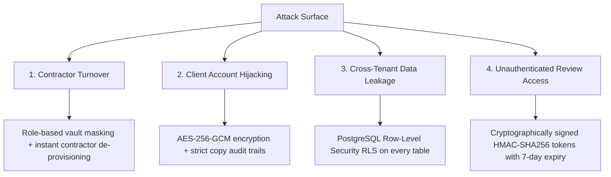

# Security Model: Credential Vault, Tokenized Review, & RLS Architecture

This document defines the comprehensive security, encryption, data isolation, and audit architecture for the Atom & Echo Operating System.

---

## 1. Threat Model & Security Boundaries

Atom & Echo handles extremely sensitive client assets:
* Executive LinkedIn account credentials (which hold personal brand reputation, private DMs, and investor contacts).
* API keys and seats for high-volume outreach tools (HeyReach, Clay, Taplio).
* Client billing and commercial terms.
* Unpublished proprietary business strategies and metrics.

### Security Attack Surface & Mitigations


---

## 2. The Credential Vault Architecture

### 2.1 Encryption at Rest
* **Algorithm**: `AES-256-GCM` (Galois/Counter Mode) with an initialization vector (IV) unique per credential record.
* **Key Hierarchy**:
  * **Master Vault Key (MVK)**: Managed via secure environment variables (`VAULT_MASTER_KEY`), never stored in the database.
  * **Data Encryption**: The plain text secret is encrypted on the Next.js API server layer prior to PostgreSQL insertion. The database stores ciphertext and the initialization vector.

### 2.2 UI Masking & Safe Interaction Flow
```
1. Default State:
   [ LinkedIn Personal ]  username: john@fintech.io  password: [ •••••••••••• ]  [ Reveal ] [ Copy ]

2. Reveal Clicked:
   - System triggers API: POST /api/vault/unmask
   - Server validates caller's session & role
   - Server writes immutable row into `credential_audit_logs`
   - UI reveals password for 30 SECONDS with a visual countdown timer
   - After 30 seconds, UI automatically reverts to masked bullets

3. Copy Clicked:
   - Copies directly to system clipboard
   - Server logs audit event: action = 'copy_password'
   - UI displays toast: "Password copied to clipboard (Logged for audit)"
```

### 2.3 Immutable Credential Audit Logging
Every interaction with a credential secret produces an unalterable log:
```sql
CREATE TABLE credential_audit_logs (
    id UUID PRIMARY KEY DEFAULT gen_random_uuid(),
    credential_id UUID NOT NULL REFERENCES credentials(id) ON DELETE CASCADE,
    user_id UUID NOT NULL REFERENCES users(id),
    action vault_action NOT NULL, -- 'view_masked', 'unmask_password', 'copy_password'
    ip_address TEXT NOT NULL,
    user_agent TEXT NOT NULL,
    created_at TIMESTAMPTZ DEFAULT now() NOT NULL
);
```

---

## 3. Client Review Portal Security (Zero-Login Architecture)

### 3.1 Token Generation & Cryptography
* When content is sent for client review, the system generates a high-entropy cryptographically secure random token (32 bytes / 256 bits).
* The raw token is signed using `HMAC-SHA256` with an agency secret key.
* The database stores only the SHA-256 hash of the token (`token_hash`).
* The raw token is embedded in the magic link:
  `https://os.atomecho.com/review?token=ae_tok_9f82b173c09e4f218a...`

### 3.2 Scoped Authorization & Zero Data Leaks
1. **No Password Friction**: Client founders do not need to register, remember passwords, or sign into Google.
2. **Strict Scope**: A review token is bound strictly to `client_id`.
   * The API endpoint `/api/review/items` extracts the token, hashes it, queries `review_tokens`, and joins `content_items` WHERE `content_items.client_id = review_tokens.client_id`.
   * A client can NEVER view posts, context, or data belonging to another client.
3. **Expiration & Invalidation**:
   * Tokens expire automatically after 7 days.
   * If a client reports a compromised link or Sudeesh clicks "Revoke Access", `review_tokens.revoked` is set to `true`, instantly blocking subsequent requests.

---

## 4. PostgreSQL Row-Level Security (RLS) Framework

Every table in the Atom & Echo OS enforces PostgreSQL Row-Level Security:

```sql
-- Enable RLS across core tables
ALTER TABLE clients ENABLE ROW LEVEL SECURITY;
ALTER TABLE content_items ENABLE ROW LEVEL SECURITY;
ALTER TABLE credentials ENABLE ROW LEVEL SECURITY;
ALTER TABLE invoices ENABLE ROW LEVEL SECURITY;

-- Helper function to extract user organization
CREATE OR REPLACE FUNCTION current_user_org_id() 
RETURNS UUID AS $$
  SELECT organization_id FROM users WHERE id = auth.uid();
$$ LANGUAGE sql STABLE;

-- Tenant Isolation Policy
CREATE POLICY tenant_isolation_clients ON clients
  FOR ALL
  USING (organization_id = current_user_org_id());

-- Credential Vault Role-Based Policy
CREATE POLICY vault_access_policy ON credentials
  FOR SELECT
  USING (
    EXISTS (
      SELECT 1 FROM users 
      WHERE users.id = auth.uid() 
      AND users.role IN ('admin', 'lead_operator')
    )
  );

-- Contractors can NEVER query the credentials table
CREATE POLICY contractor_block_credentials ON credentials
  FOR ALL
  USING (
    EXISTS (
      SELECT 1 FROM users 
      WHERE users.id = auth.uid() 
      AND users.role NOT IN ('writer', 'designer')
    )
  );
```

---

## 5. Offboarding & Incident Response Protocol

When a contractor, freelance writer, or employee leaves the agency:
1. **1-Click Seat De-provisioning**: Admin toggles `users.is_active = false`. Supabase session tokens are immediately revoked.
2. **Automated Audit Review**: System generates a report of all credentials accessed by that user in the preceding 30 days.
3. **Password Rotation Checklist**: System flags accounts accessed by the departing contractor with an orange warning: *"Credential accessed by departed user. Recommend password rotation."*
