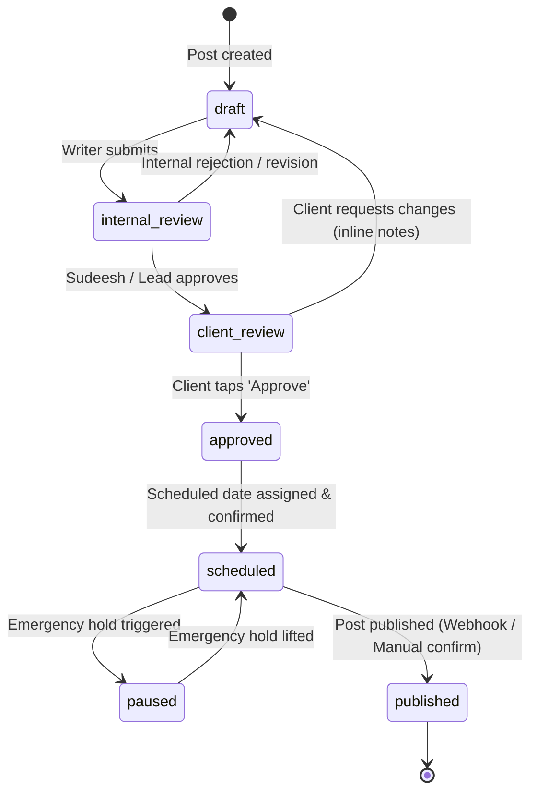
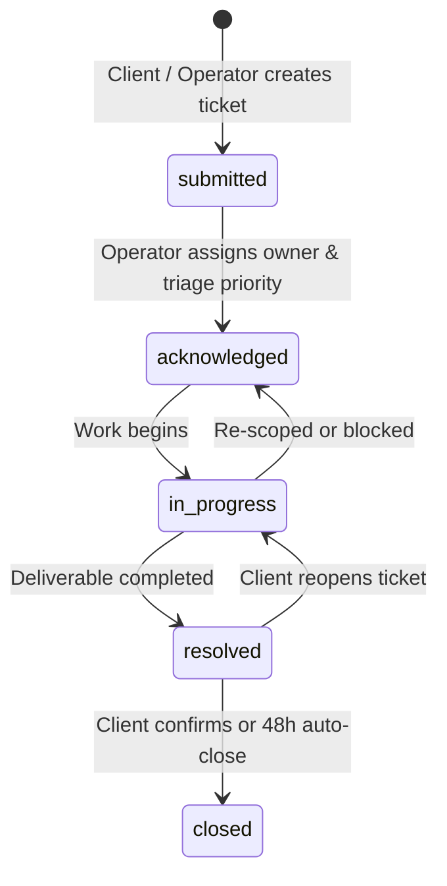
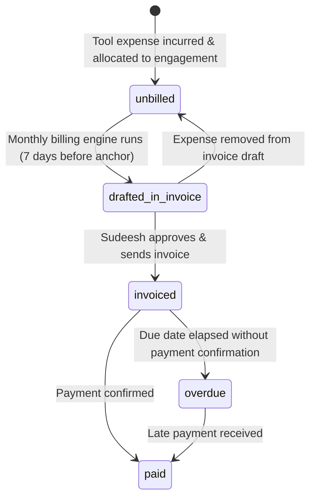

# State Machines & Operational Lifecycles: Atom & Echo OS

This document defines the formal finite state machines (FSMs), valid state transitions, transition guardrails, and automated side-effects for all operational lifecycles in the Atom & Echo Operating System.

---

## 1. Content State Machine

The Content State Machine governs the core production loop of personal branding and marketing collateral.

### 1.1 State Diagram

### 1.2 Transition Matrix & Guardrails

| From State | To State | Trigger / Initiator | Guardrail / Pre-Condition | Automated Side-Effect |
| :--- | :--- | :--- | :--- | :--- |
| `[*] (New)` | `draft` | Writer / Admin | Engagement must be `active` | Assigns initial writer, sets created_at |
| `draft` | `internal_review` | Writer | Body must have > 50 characters, title non-empty | Notifies assigned lead operator via UI badge |
| `internal_review` | `draft` | Lead Operator / Sudeesh | Internal comment required | Re-assigns to writer with feedback tag |
| `internal_review` | `client_review` | Lead Operator / Sudeesh | Tone validation passed (0 taboo words) | Generates cryptographically signed PWA token |
| `client_review` | `draft` | Client (via PWA) | At least 1 feedback item recorded | Emits event `content.revision_requested`; alerts writer |
| `client_review` | `approved` | Client (via PWA) | Token must be valid and unexpired | Emits `content.approved`; locks copy; computes schedule date |
| `approved` | `scheduled` | System / Operator | `scheduled_publish_date` must be present | Temporal projection appears on Master Calendar |
| `scheduled` | `paused` | Client / Operator | Client request of category `emergency_hold` | Content temporarily hidden from publishing queue |
| `paused` | `scheduled` | Lead Operator | Emergency hold resolved | Restores slot on Master Calendar |
| `scheduled` | `published` | External webhook / Operator | Requires post live confirmation | Emits `content.published`; closes review token |

---

## 2. Client Service Request State Machine

Governs ad-hoc client feedback, emergency holds, and creative change requests.

### 2.1 State Diagram

### 2.2 Transition Guardrails & Emergency Hold Cascade
* **Emergency Hold Rule**: When a request of category `emergency_hold` enters `submitted` or `acknowledged` status:
  * An automated system hook immediately scans all `content_items` belonging to that client in status `scheduled`.
  * All such items are automatically transitioned to `paused`.
  * A high-priority banner is injected into the Command Center triage feed.
* **Resolution Rule**: An `emergency_hold` request cannot transition to `closed` until the operator explicitly selects whether to resume scheduled posts or re-draft them.

---

## 3. Financial & Tool Expense Lifecycle

Governs third-party tool expense capture and invoice generation.

### 3.1 State Diagram

### 3.2 Transition Guardrails
* **Locking on Invoicing**: Once an expense enters `invoiced`, it is immutable. It cannot be edited or deleted unless the invoice is formally voided.
* **Overdue Transition**: Handled automatically by Inngest cron: if `now() > due_date` and status is `sent`, status shifts to `overdue` and fires an alert into the Command Center.

---

## 4. Outbound Campaign State Machine

Governs cold outreach and outbound sales campaigns (managing high-level state while leaving lead scraping mechanics to Clay/HeyReach).

### 4.1 State Diagram

```mermaid
stateDiagram-v2
    [*] --> ideation : New campaign concept defined
    ideation --> list_building : ICP established; lead scraping begins
    list_building --> copywriting : Lead criteria approved in external Sheet
    copywriting --> client_review : Outreach sequence drafted
    client_review --> active : Sequence approved & loaded into sending tool
    active --> paused : Bounce rate warning / Client request
    paused --> active : Issues resolved; sending resumed
    active --> completed : Target volume fulfilled
```

### 4.2 Transition Rules
* **External Link Requirement**: Transition from `ideation` to `list_building` requires a valid Google Sheet / Clay URL.
* **KPI Baseline**: Moving to `active` requires setting target reach and target reply rate.
