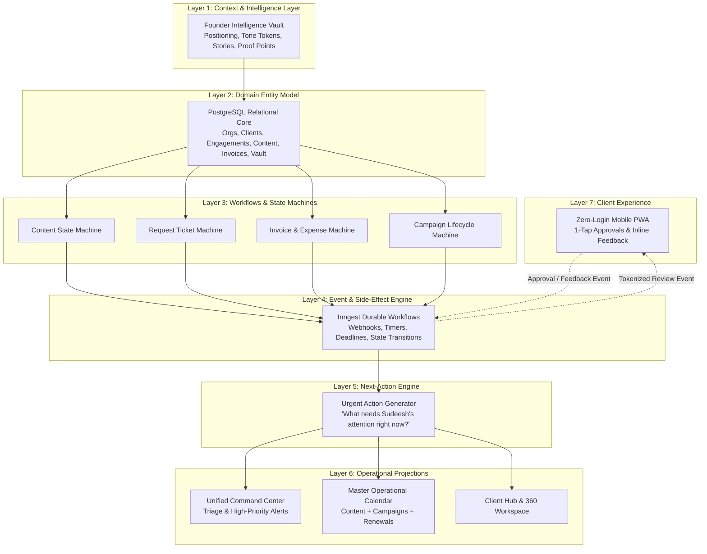

# System Blueprint: The 7-Layer Operational Architecture

This document defines the foundational system architecture of the Atom & Echo Operating System (BaseEngine). It establishes how entities, workflows, events, and user interfaces interconnect into an integrated operational engine rather than an ad-hoc collection of database tables.

---

## 1. The Core Architectural Philosophy: "Manual by Exception"

Traditional agency tools (like Notion or generic task boards) operate on **Passive Storage**:
* A user must manually create every task, manually update every status tag, manually copy dates onto a calendar, and manually remember when invoices or client renewals are due.
* When people get busy, manual updates stop. The system rots, states drift, and chaos resumes.

The Atom & Echo OS operates on **Active Operational State & Automation by Exception**:
1. **The System Holds the State**: When a content post is approved, the system calculates the next available publishing slot and schedules it.
2. **Temporal Projections, Not Data Entry**: The Calendar is never an input screen. It is an automatic projection of scheduled content, campaign milestones, and billing cycles.
3. **Humans Intervene Only on Exceptions**: The Command Center surfaces only what requires attention: a post waiting > 48h for approval, an unbilled tool expense, an approaching retainer renewal, or an urgent client ticket. If operations are smooth, the system runs autonomously.

---

## 2. The 7-Layer Operational Framework

---

## 3. Detailed Specification of the 7 Layers

### Layer 1: Context & Intelligence Layer (The Soul of the Agency)
* **Purpose**: Capture and maintain deep founder positioning, tone rules, and verified proof points so that ghostwriters and automated tools produce authentic content without asking basic questions.
* **Key Components**:
  * **Tone Matrix**: Explicit voice archetypes (e.g., *Contrarian Builder* vs. *Analytical Advisor*).
  * **Taboo Tokens**: Forbidden words and clichés automatically flagged in the editor.
  * **Proof Bank**: Verified client metrics, customer names, ARR figures, and milestones.
  * **Narrative Vault**: Origin stories, pivotal business moments, and founder frameworks.

### Layer 2: Domain Entity Model (The Relational Core)
* **Purpose**: Replace loose Notion pages with strict, normalized PostgreSQL entities and referential integrity.
* **Hierarchy**:
  $$\text{Organization} \longrightarrow \text{Client} \longrightarrow \text{Engagement (Retainer)} \longrightarrow \{\text{Content}, \text{Campaign}, \text{Invoice}, \text{Credential Vault}, \text{Request}\}$$
* **Rule**: Nothing exists in a vacuum. A piece of content is strictly linked to a client engagement; an expense is strictly linked to a client; a credential belongs to an audited vault record.

### Layer 3: Workflows & State Machines (Enforced Business Rules)
* **Purpose**: Guardrails that prevent illegal state transitions.
* **Examples**:
  * A post cannot transition to `Client Review` unless it has passed `Internal Review`.
  * A post cannot transition to `Scheduled` without a verified `scheduled_date` and client approval token.
  * An expense cannot be marked `Reimbursed` without an attached invoice foreign key.

### Layer 4: Event & Side-Effect Engine (Durable Background Orchestration)
* **Purpose**: Listen to domain events and execute reliable, multi-step asynchronous actions using Inngest.
* **Examples**:
  * Event `content.approved_by_client` &rarr; Locks schedule date, logs audit event, sends Slack/WhatsApp notification to assigned operator, and invalidates review token.
  * Event `billing.cycle_7_days_out` &rarr; Aggregates pending pass-through tool expenses and creates a draft invoice entity for admin review.
  * Event `review.stalled_48h` &rarr; Generates an urgent reminder on the Command Center triage feed.

### Layer 5: Next-Action & Triage Engine (Cognitive Offload)
* **Purpose**: Answer Sudeesh's daily question: *"What is broken, what is stuck, and what needs my attention right now?"*
* **Mechanism**: Runs continuous query heuristics against operational states:
  * Flag posts in `Internal Review` > 24 hours.
  * Flag posts in `Client Review` > 72 hours.
  * Flag invoices `Overdue` > 3 days.
  * Flag tools renewing in < 5 days without an active client engagement.

### Layer 6: Operational Projections (The Internal Workspace)
* **Purpose**: Render the state of the agency in high-fidelity, actionable views without requiring users to manually manage calendars.
* **Surfaces**:
  * **Command Center**: Morning cockpit with triage alerts, quick approval queue, and KPI snapshot.
  * **Master Temporal Calendar**: Multi-layer calendar rendering content delivery dates, campaign launches, and client billing dates.
  * **Client 360 Hub**: Everything about a client on one screen (strategy, active posts, expenses, passwords, requests).

### Layer 7: Client Experience Layer (Zero-Login Mobile PWA)
* **Purpose**: Completely eliminate friction from the client's perspective.
* **Architecture**: A server-rendered Next.js mobile web app accessed via cryptographically signed tokens.
* **User Flow**: Client clicks WhatsApp link &rarr; opens instant mobile card feed &rarr; taps 1-click Approve or adds inline note &rarr; closes browser in < 30 seconds.

---

## 4. System Boundaries & Tool Integrations

| Subsystem / Capability | Handled by BaseEngine OS | Handled by External Tool | Integration Architecture |
| :--- | :--- | :--- | :--- |
| **Personal Branding Pipeline** | **100% Native** (Idea, Draft, Review, Schedule, Calendar) | External publishing (Taplio / LinkedIn API) | Webhook / API trigger on `Scheduled` state |
| **Client Review & Approvals** | **100% Native** (Zero-login PWA) | None | Cryptographic JWT magic links over WhatsApp |
| **Credential Storage** | **100% Native** (AES-256 Vault) | None | PostgreSQL encrypted columns + audit table |
| **Cold Outreach Campaigns** | **Campaign Entity Tracking** (Status, ICP, Launch date) | Clay / HeyReach / Smartlead (Lead generation & scraping) | Direct deep-links to external Google Sheets / Clay tables |
| **Tool & Retainer Billing** | **Native Expense & Invoice Draft Generation** | Stripe / Razorpay / Bank wire (Payment rails) | Webhook updates invoice status from `Sent` to `Paid` |
| **Meeting Intelligence** | **Meeting Entity & Transcript Ingestion** | Fathom / Google Meet (Audio recording & AI transcription) | Fathom webhook pushes transcript into Client Knowledge Vault |
