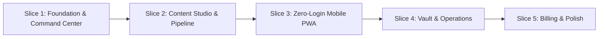

# Phase 1 Specification: Atom & Echo Operating Core (BaseEngine)

This document specifies the complete scope, architectural deliverables, operational modules, commercial terms, and vertical slice execution roadmap for **Phase 1** of the Atom & Echo Operating System.

---

## 1. Executive Summary & Core Objective

The objective of Phase 1 is to establish the **Atom & Echo Operating Core (BaseEngine)**:
* Transition Atom & Echo from a fragmented collection of Notion databases, Google Sheets, and WhatsApp chats into a unified, purpose-built agency operating system.
* Provide Sudeesh and his team with a single operational cockpit to manage client personal branding, content pipelines, approvals, credentials, tool expenses, and client requests.
* Deliver an effortless, zero-login mobile review experience for busy founder clients that reduces turnaround times from days to minutes.

---

## 2. The 5 Core Operational Outcomes

| # | Outcome | Current Failure Mode | Phase 1 Operating Reality |
| :--- | :--- | :--- | :--- |
| **1** | **Unified Command Center** | Sudeesh checks 8+ tabs; lacks single answer to *"What is stuck?"* | Single morning cockpit prioritizing items needing urgent attention (overdue reviews, stalled posts, renewing tools). |
| **2** | **Frictionless Mobile Review** | Founders ignore Notion links; 1–2 weeks of WhatsApp chasing | Zero-login mobile PWA accessed via tokenized WhatsApp magic links. 1-tap Approve or inline revision notes. |
| **3** | **Unified Content Pipeline** | Internal and Client calendars require manual duplicate copy-pasting | Single content record with state machine. Calendar is an automatic temporal projection of scheduled dates. |
| **4** | **Secure Credential Vault** | Plaintext client passwords stored in Notion pages & WhatsApp | Native AES-256 encrypted vault with masked fields, role access, and immutable audit logs. |
| **5** | **Zero-Leak Tool Billing** | Pass-through tools (HeyReach, Clay) forgotten during invoicing | Automated expense aggregation. Tool expenses auto-attach as itemized line items on monthly retainer drafts. |

---

## 3. Detailed Architecture Modules (Phase 1)

### Module 1: Unified Command Center & Triage Feed
* **Header KPI Snapshot**: Active retained clients, content items in review, scheduled posts this week, pending invoice volume.
* **Urgent Action Generator**: Algorithmic triage queue flagging:
  * Posts in `internal_review` > 24 hours.
  * Posts in `client_review` > 48 hours (with 1-click WhatsApp follow-up link).
  * Invoices overdue or approaching billing anchor day.
  * Tools renewing within 5 days without an active client allocation.
* **Quick Actions**: "New Post", "New Client Request", "Add Tool Expense", "Log Credential".

### Module 2: Client 360 Hub & Engagement Management
* **Client Profile**: Company name, founder details, direct WhatsApp link, industry, website, LinkedIn profile.
* **Commercial Terms**: Active service type (`LinkedIn Branding`, `Cold Outreach`, `Hybrid`), monthly retainer amount, billing anchor day, start/renewal dates.
* **Structured Context Vault**:
  * Core positioning & target ICP.
  * Voice archetype and cadence rules.
  * Real-time taboo word blacklist (`{"synergy", "game-changer", "delve"}`).
  * Key stories, frameworks, and verified proof metrics.

### Module 3: Unified Content Studio & Production Pipeline
* **Kanban & List Views**: Strict state progression: `Draft` &rarr; `Internal Review` &rarr; `Client Review` &rarr; `Approved` &rarr; `Scheduled` &rarr; `Published`.
* **Authoring Environment**:
  * Markdown editor with real-time word counter and LinkedIn post simulator preview.
  * Automated taboo word scanner highlighting forbidden buzzwords in real time.
  * Slide-out Context Drawer allowing writers to search client stories and inject proof points directly into drafts.
* **Revision History**: Tracks edits, internal comments, and client feedback.

### Module 4: Zero-Login Client Review Mobile PWA
* **Zero Authentication**: Client receives a cryptographically signed link (`https://os.atomecho.com/review?token=...`).
* **Mobile-First LinkedIn Simulation**: Posts render exactly as they appear in the LinkedIn mobile app (avatar, author title, hook, "see more" fold, image/carousel preview).
* **1-Tap Actions**:
  * Large green **"Approve Post"** button (immediately shifts post to `Approved` and locks publishing date).
  * **"Request Changes"** button with quick pre-set tag pills (*"Weaken claim"*, *"Too casual"*, *"Update number"*) plus inline comment text box.

### Module 5: Master Temporal Operational Calendar
* **Pure Operational Projection**: Not an input database. Reads directly from:
  * Content items where `scheduled_publish_date IS NOT NULL`.
  * Outbound campaign launch milestones.
  * Client billing anchor dates and tool subscription renewals.
* **Views**: Month, Week, and Day agenda views with client filter chips and status colors.

### Module 6: Client Requests & Emergency Hold System
* **Structured Ticket Intake**: Category (`Emergency Hold`, `Content Pivot`, `Design Tweak`, `Tool Issue`, `General Query`), priority, assignment, status.
* **Emergency Hold Automation**: Creating an emergency hold ticket automatically cascades status `paused` across all scheduled posts for that client, preventing unauthorized posts from going live.

### Module 7: Encrypted Credential Vault
* **Security Specifications**:
  * Master Key AES-256-GCM encryption at rest on server layer.
  * Fields masked (`••••••••`) by default in the UI.
  * Reveal password with 30-second ephemeral countdown.
  * 1-click Copy with toast confirmation.
  * Immutable `credential_audit_logs` capturing user, action, IP, and timestamp.

### Module 8: Tool Expenses & Retainer Billing Engine
* **Tool Catalog**: Track agency tool licenses (HeyReach, Clay, Proxies, Domains) with cost, renewal date, and billing cycle.
* **Client Expense Allocation**: Allocate specific tool costs to client engagements.
* **Automated Invoice Drafts**: 7 days before client's billing anchor day, the system drafts a consolidated invoice combining the base monthly retainer and unbilled pass-through tool expenses.

---

## 4. Vertical Slice Delivery Roadmap (5 Slices)

### Slice 1: Core Foundation & Command Center
* Supabase PostgreSQL schema, migrations, RLS policies, and Auth setup.
* Organization, Users, Clients, and Engagements CRUD.
* Command Center shell with triage alert engine and KPI metrics.

### Slice 2: Content Production Studio & Master Calendar
* Content item schema and finite state machine transitions.
* Rich post editor with taboo word linter and Client Context drawer.
* Master Operational Calendar projecting scheduled content slots.

### Slice 3: Zero-Login Client Review Mobile PWA
* Token generation service with SHA-256 hashing and 7-day expiration.
* Mobile-responsive PWA feed with realistic LinkedIn post simulation.
* 1-tap Approve and revision feedback loops with real-time database updates.

### Slice 4: Credential Vault, Client Requests, & Emergency Hold
* AES-256 Credential Vault with role masking and immutable audit logging.
* Client service requests ticket board with priority routing.
* Emergency hold cascading automation pausing scheduled posts.

### Slice 5: Tool Expenses, Invoicing Engine, & Production Polish
* Tool subscription tracking and client expense allocation.
* Automated invoice draft generator aggregating retainers + tool line items.
* Full operational walkthrough, data seed from active Notion, and UAT sign-off.

---

## 5. Commercial Agreement Alignment

* **Total Project Investment**: **Rs. 1,50,000 (One Lakh Fifty Thousand Indian Rupees)**.
* **Payment Schedule**:
  * **Milestone 1 (50% - Rs. 75,000)**: Project initiation, system architecture, database schema, and Slices 1–3 completion.
  * **Milestone 2 (50% - Rs. 75,000)**: Slices 4–5 delivery, active client data migration, User Acceptance Testing (UAT) sign-off, and live production deployment.
* **Formal Deliverables**: Complete source code repository, Supabase cloud environment, Inngest workflow configuration, and 30-day post-launch operational support.
