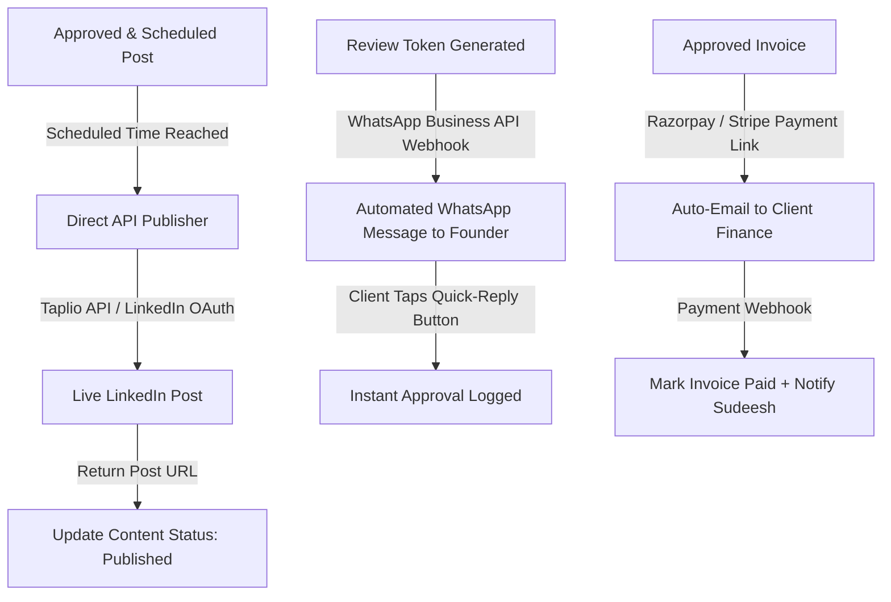
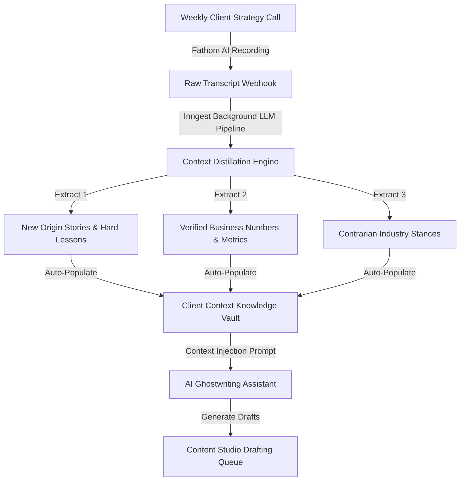

# Phase 2 Roadmap: Automations, AI Operating Layer, & Sales Engine

This document outlines the strategic roadmap for Phase 2 of the Atom & Echo Operating System, broken into three modular sub-phases: **Phase 2A (Deep Automations)**, **Phase 2B (AI Operating Layer)**, and **Phase 2C (Outbound Sales OS)**.

---

## 1. Why Defer to Phase 2?

As established in the core architecture principles:
* **The Operational Core Must Precede Automation**: If you automate a chaotic, unproven process, you only produce automated chaos.
* Phase 1 proves the data models, state machines, and human approval loops.
* Phase 2 layers on automation, artificial intelligence, and third-party API integrations on top of rock-solid operational primitives.

---

## 2. Phase 2A: Deep Workflow Automations

### Key Deliverables in 2A:
1. **Direct Social Publishing Engine**:
   * Direct integration with LinkedIn API or Taplio webhook.
   * Eliminates the final manual step of copying approved text from the OS into LinkedIn or scheduling software.
2. **Two-Way WhatsApp Business API Integration**:
   * Instead of Sudeesh clicking a pre-filled WhatsApp web link, the system sends notifications automatically via the official WhatsApp Business Cloud API.
   * Allows clients to approve directly by replying *"YES"* or *"APPROVE"* in the WhatsApp chat thread.
3. **Automated Payment Gateway Reconciliation**:
   * Connects Razorpay or Stripe to the Invoicing Engine.
   * Automatically generates payment links and marks invoices as `Paid` upon webhook receipt, eliminating manual bank wire checking.

---

## 3. Phase 2B: The AI Operating Layer & Meeting Intelligence

### Key Deliverables in 2B:
1. **Automated Meeting Context Ingestion**:
   * Ingests Fathom meeting transcripts automatically via webhooks.
   * An LLM pipeline analyzes the conversation, extracts new proof points, customer quotes, and stories, and automatically populates the `knowledge_items` table.
2. **Context-Conditioned AI Ghostwriting Assistant**:
   * Generates draft posts directly inside the Content Studio conditioned on the client's verified tone rules, taboo blacklist, and recent meeting stories.
   * Produces authentic, story-driven first drafts in seconds, accelerating writer output by 3x.
3. **Automated Hook & Virality Scoring**:
   * Evaluates draft hooks against historical LinkedIn engagement data, offering 3 alternative high-converting opening lines before internal review.

---

## 4. Phase 2C: Full Outbound Sales & Campaign Engine

In Phase 1, outbound campaigns are tracked as high-level entities linking out to external Google Sheets. In Phase 2C, outbound becomes a first-class operational subsystem.

### Key Deliverables in 2C:
1. **Direct Clay & HeyReach Webhook Sync**:
   * Ingests real-time campaign statistics: total leads contacted, open rates, bounce rates, and reply rates.
2. **Unified Reply & Lead Triage Inbox**:
   * Positive replies across multiple client inboxes are aggregated into a single high-priority feed for Sudeesh to review and assign.
3. **Automated Domain & Inbox Health Monitor**:
   * Monitors cold email domain deliverability, bounce rates, and spam complaints, alerting operators before a domain gets blacklisted.

---

## 5. Phase 2 Prerequisites & Transition Triggers

Phase 2 development will begin only when the following operational benchmarks are achieved in Phase 1:
1. Sudeesh and the Atom & Echo team manage 100% of active clients exclusively out of the BaseEngine OS for at least 30 consecutive days.
2. At least 50 content posts have successfully transitioned through the complete lifecycle: `Draft` &rarr; `Client Review` &rarr; `Approved` &rarr; `Scheduled` via the mobile PWA.
3. At least one complete monthly billing cycle has been executed with automated pass-through tool expense aggregation.
