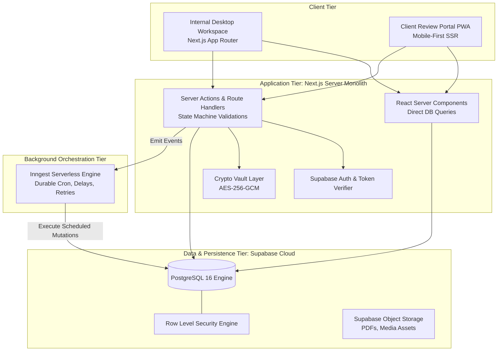

# Technical Architecture Specification: Atom & Echo OS

This document specifies the technical architecture, runtime environments, frameworks, database systems, and background orchestration infrastructure for the Atom & Echo Operating System (BaseEngine).

---

## 1. Core Architectural Paradigm: The Cohesive Modular Monolith

To optimize for engineering velocity, bulletproof reliability, and zero operational overhead, Atom & Echo OS is architected as a **Cohesive Modular Monolith**:
* Avoids microservices complexity, distributed tracing sprawl, and multi-repo synchronization hell.
* Consolidates frontend rendering, backend API endpoints, state machines, and database access into a single unified TypeScript codebase.
* Utilizes durable asynchronous background execution (Inngest) to decouple long-running tasks, timers, and webhooks from synchronous user requests.



---

## 2. Technology Stack Selection & Rationale

| Layer | Technology | Version | Rationale & Trade-Offs |
| :--- | :--- | :--- | :--- |
| **Framework** | Next.js (App Router + Turbopack) | 16.x | Native Turbopack compilation, React 19.3 Server Components, and sub-second HMR. |
| **Language** | TypeScript | 5.8+ | Strict end-to-end type safety shared across database schemas, state machines, and UI components. |
| **Database** | PostgreSQL (Supabase) | 16.x | World-class relational ACID compliance, native JSONB support, Row Level Security (RLS), and pgvector readiness. |
| **Authentication** | Supabase Auth | Latest | Secure session cookies, MFA support for agency staff, and token-based header authentication for APIs. |
| **Background Jobs** | Inngest | Latest | Durable workflows with built-in retries, step-level idempotency, and serverless cron scheduling without managing Redis/BullMQ. |
| **Styling** | Tailwind CSS | 4.x | CSS-first `@theme` architecture via `@tailwindcss/postcss`, zero runtime overhead, and custom BaseWorks design tokens. |
| **Icons** | Lucide React | 1.47+ | Clean, consistent, lightweight SVG icon system. |
| **Storage** | Supabase Storage | Latest | S3-compatible asset bucket for client logos, post carousel PDFs, and media attachments. |

---

## 3. Data Flow & Security Architecture

### 3.1 Synchronous Reads (React Server Components)
* Internal dashboard views query PostgreSQL directly on the server layer using type-safe queries generated by Supabase Client.
* Bypasses client-side REST waterfalls (`fetch` inside `useEffect`).
* Row Level Security (RLS) policies are automatically enforced at the PostgreSQL connection level using the authenticated user's session token.

### 3.2 Synchronous Mutations (Server Actions)
* All state mutations (e.g., submitting a post, approving a review, adding a tool expense) execute as Next.js Server Actions.
* Flow:
  1. Validate caller session and permission role.
  2. Validate input schema using Zod.
  3. Verify valid state transition against the formal State Machine.
  4. Perform atomic PostgreSQL transaction.
  5. Emit domain event to Inngest event bus.
  6. Revalidate relevant Next.js cache paths.

### 3.3 Asynchronous Execution (Inngest Durable Workflows)
* Long-running, multi-step, or time-delayed operations run asynchronously via Inngest functions:
  * **SLA Watchdogs**: Sleep 48 hours after `client_review` transition &rarr; check if still pending &rarr; send alert.
  * **Billing Automation**: Daily cron &rarr; calculate 7 days to anchor day &rarr; aggregate tool expenses &rarr; draft invoice.
  * **Emergency Hold Cascade**: On ticket creation &rarr; execute atomic update on all scheduled content items.

---

## 4. Planned Application Source Directory Layout

```
src/
├── app/                                 # Next.js App Router root
│   ├── (auth)/login/                    # Internal staff login route
│   ├── (workspace)/                     # Authenticated operator workspace
│   │   ├── layout.tsx                   # Master sidebar shell & global search
│   │   ├── command-center/              # Morning cockpit & triage feed
│   │   ├── clients/                     # Client directory & 360 workspace
│   │   │   └── [id]/                    # Tabbed client workspace (Context/Vault/Billing)
│   │   ├── content/                     # Content production Kanban & studio
│   │   │   └── [id]/                    # Post editor & LinkedIn mobile preview
│   │   ├── calendar/                    # Master temporal operational calendar
│   │   ├── operations/                  # Client requests & emergency hold tickets
│   │   ├── billing/                     # Tool expenses & retainer invoices
│   │   └── settings/                    # Team seats, audit logs, security settings
│   ├── review/                          # Client Review Mobile PWA (Zero-Login)
│   │   ├── page.tsx                     # Mobile feed simulating LinkedIn card
│   │   └── actions.ts                   # 1-tap Approve & feedback server actions
│   └── api/                             # Webhook listeners (Fathom, Inngest, Stripe)
│       └── inngest/route.ts             # Inngest endpoint handler
│
├── components/                          # Reusable UI component library
│   ├── ui/                              # Atoms: Button, Card, Badge, Modal, Drawer, Toast
│   ├── command-center/                  # TriageFeed, StatCard, QuickActions
│   ├── content/                         # PostEditor, LinkedInSimulator, TabooLinter, ContextDrawer
│   ├── clients/                         # ContextVaultView, CredentialVaultTable, RetainerCard
│   └── calendar/                        # OperationalMonthView, ProjectionCard
│
├── inngest/                             # Durable background workflows
│   ├── client.ts                        # Inngest client initialization
│   └── functions/                       # SLA watchdogs, billing cron, hold cascade
│
├── lib/                                 # Core business logic & utilities
│   ├── supabase/                        # Database client & server utilities
│   ├── state-machines/                  # Content, Request, Invoice transition guards
│   ├── security/                        # AES-256 Vault crypto & HMAC token generators
│   └── formatting/                      # Currency (Rs.), LinkedIn folds, date formatters
│
└── types/                               # TypeScript domain definitions
    └── database.types.ts                # Auto-generated Supabase schema types
```

---

## 5. Deployment & Environment Strategy

* **Production Hosting**: Vercel Serverless Edge network.
* **Database & Storage**: Supabase Hosted Project (AWS Mumbai / `ap-south-1` region for low latency to Indian users).
* **Workflow Engine**: Inngest Cloud.
* **Key Environment Variables**:
  * `NEXT_PUBLIC_SUPABASE_URL`: Supabase project endpoint.
  * `NEXT_PUBLIC_SUPABASE_ANON_KEY`: Client-safe anonymous key.
  * `SUPABASE_SERVICE_ROLE_KEY`: Elevated key for backend migrations and webhooks.
  * `VAULT_MASTER_KEY`: 32-byte hex key for AES-256-GCM Credential Vault encryption.
  * `TOKEN_SECRET_KEY`: High-entropy key for signing client PWA review tokens.
  * `INNGEST_EVENT_KEY` / `INNGEST_SIGNING_KEY`: Workflow orchestration keys.
