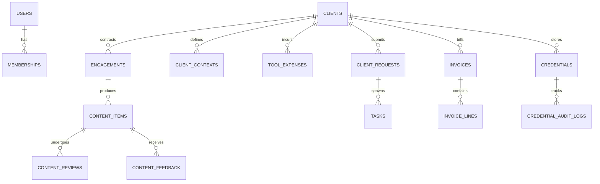

# Database Schema — Logical Model & Data Architecture

This document describes the relational data architecture for Atom & Echo OS. The canonical PostgreSQL DDL migration script is maintained in [`05_TECH/DATABASE_SCHEMA.sql`](file:///d:/BaseWorks/Atom%20&%20Echo/05_TECH/DATABASE_SCHEMA.sql).

---

## 1. Core Entity Relational Diagram

---

## 2. Core Relational Constraints

1. **Foreign Key Integrity**:
   All child records (engagements, content items, tool expenses, credentials) are bound to a valid `client_id` with `ON DELETE CASCADE` or `RESTRICT` rules.
2. **Idempotency Keys**:
   External inbound event records store provider event IDs to prevent duplicate actions or double billing.
3. **No Plaintext Secrets**:
   The `credentials` table encrypts password and API token payloads at rest using AES-256-GCM.
4. **Row-Level Security (RLS)**:
   All queries validate tenant and role authorization in Supabase before returning rows.
